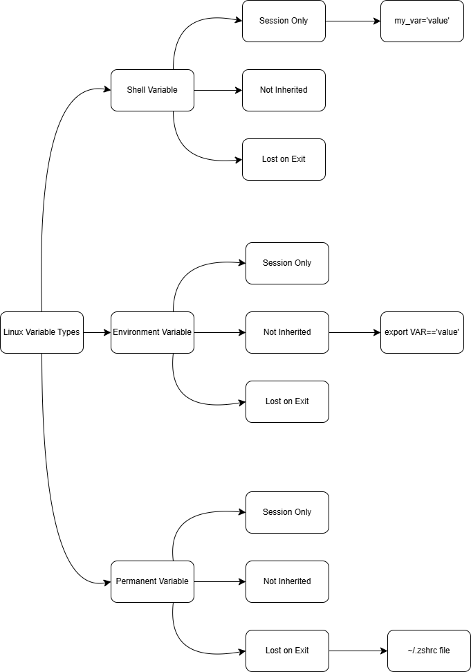

# Environment Variabel PATH Linux

Kali ini kita akan membahas tentang environment variable di Linux. Environment Variable merupakan value dinamis yang dapat memengaruhi perilaku proses yang sedang berjalan di komputer. Mereka memainkan peran penting dalam system configuration dan program execution. Dengan menguasai environment variable, kamu akan memperoleh keterampilan esensial untuk Linux system administration dan software development.

Pada lab ini kita akan belajar cara membuat, melihat, mengubah, dan menghapus environment variable. Kita juga akan membahas cara membuat perubahan ini permanen dan memahami beberapa environment variable bawaan yang paling penting di Linux.

<h3>Memahami Variabel pada Linux</h3>

Sebelum kita membahas environment variable, kita mulai dengan shell variable dasar. Hal ini akan membantu untuk memahami konsep variabel di Linux

1. Buka terminal. Kita buat direktori baru pada direktori `/home/user` dengan nama proyek dengan command `mkdir`, lalu pindah ke direktori yang telah dibuat tersebut:
```
mkdir /home/nyctoselene/project
cd /home/nyctoselene/project
```
2. Lalu, kita buat shell variable sederhana. Di linux, kita bisa membuat variable dengan hanya memberikan value kepada sebuah nama. Kita buat variabel bernama `my_var`:
```
my_var="Saya bisa membuat variabel"
```
**Catatan Penting**: Saat menetapkan variabel di Bash (dan Zsh, yang kita gunakan dalam lab ini), tidak boleh ada spasi di sekitar tanda sama dengan (`=`). `my_var = “Hello, Linux”` atau `my_var= “Hello, Linux”` akan menyebabkan error.

3. Untuk melihat value dari variabel, gunakan command `echo` dengan `$` sebelum nama variabel. Simbol `$` memberitahu shell untuk mengganti value dari variabel:
```
echo $my_var
```
Maka akan muncul output sebagai berikut:
```
Saya bisa membuat variabel
```
4. Variabel juga daoat diguanakan dalam command atau assignment lain. Sebagai contoh:
```
echo "Value dari my_var adalah: $my_var"
```
maka akan muncul output:
```
Value dari my_var adalah: Saya bisa membuat variabel
```
Kita baru saja membuat dan menggunakan shell variable pertama kita. Namun, variabel ini hanya tersedia pada session shell saat ini. Jika kita membuka window terminal atau tab baru, variabel ini tidak akan ada di sana. Di sinilah environment variabel dibutuhkan

<h3>Environment Variable</h3>
Setelah kita memahami variabel dasar, kita akan membahas environment variable. Environment variable adalah variabel yang tersedia untuk semua proses child dari shell. Artinya, variabel-variabel ini dapat diakses oleh script dan program yang dijalankan dari shell tersebut.

1. Untuk melihat environment variable saat ini, gunakan command `env`:
```
env
```
Ini akan menampilkan list panjang variabel, tidak perlu memahami semuanya sekrang, karena disini kita akan membahas hanyna beberapa bagian

2. Salah satu environment variable yang sangat penting dalah `PATH` kita lihat apa yang ada di dalamnya
```
echo $PATH
```
Variabel `PATH` mencantumkan direktori-direktori tempat sistem mencari program-program yang dapat dieksekusi. Setiap direktori dipisahkan oleh tanda titik dua (`:`)
```
/usr/local/sbin:/usr/local/bin:/usr/sbin:/sbin:/bin
```
3. Sekarang kita buat environment variable kita sendiri. Kita gunakan command `export` untuk membuat environment variable:
```
export MY_ENV_VAR="Ini adalah environment variable"
```
command `export` membuat variable tersedia pada proses child. ini merupakan kunci perbedaan dari shell variable dan environment variable.

4. Untuk memperjelas perbedaannya, kita buat shell script yang mencoba mengakses baik shell variable biasa maupun environment variable. Kita dapat melakukannya menggunakan `heredoc` dengan command `cat`, yang merupakan cara umum untuk menulis konten multi-baris ke dalam berkas:
```
cat << 'EOF' > test_vars.sh
#!/bin/bash
echo "Shell variable: $my_var"
echo "Environment variable: $MY_ENV_VAR"
EOF
```
Buat script tersebut executable:
```
chmod +x test_vars.sh
```
Lalu jalankan script nya:
```
./test_vars.sh
```
Maka akan keluar tampilan seperti ini:
```
Shell variable:
Environment variable: Ini adalah environment variable
```
Bisa dilihat bahwa environment variable (`MY_ENV_VAR`) dapat diakses, sementara shell variable (`my_var`) tidak. Hal ini terjadi karena `my_var` tidak diekspor, sehingga proses child (seperti script) tidak mengetahui keberadaannya.

5. Untuk memverifikasi bahwa `MY_ENV_VAR` sekarang menjadi environment variable, kita dapat menggunakan command `env` lagi, tetapi kali ini kita akan menyaring output menggunakan `grep`:
```
env | grep MY_ENV_VAR
```
Maka akan muncul variabel baru yang telah dibuat tadi

6. Kita juga bisa cek secara langsung value dari environment varaible baru:
```
echo $MY_ENV_VAR
```
<h3>Tingkat Kepermanenan Variabel</h3>
Untuk membantu memvisualisasikan perbedaan antara jeins-jenis variabel ini dan tingkat kepermanenannya, berikut adalah diagramnya:



Diagram ini memperlihatkan tiga tingkatan dari kepermanenan variabel. Berikut tabel ringkasan untuk referensi:
| Variable Type | Scope | Child Process Access | Persistence | Syntax Example |
| :------------ | :---: | :------------------: | :---------: | -------------: |
| **Shell Variable** | Current session only | No | Lost on exit | `my_var='value'` |
| **Environment Variable** | Current session only | Yes | Lost on exit | `export VAR='value'` |
| **Permanent Variable** | Current session only | Yes | Survives exit | In `~/.zshrc` file |

Memahami ketiga tingkatan ini sangat penting untuk Linux system administration yang efektif dan akan membantu dalam memilih pendekatan yang tepat untuk berbagai skenario.

<h3>Mengubah Environment Variable PATH</h3>
Variabel `PATH` adalah salah satu environment variable yang sangaat penting di Linux. Variabel ini memberitahu sistem di mana harus mencari berkas executable. Kita ubah variabel ini untuk menambahkan direktori baru.

1. Pertama, kita buat direkrori baru tempat kita akan menyimpan script custom:
```
mkdir ~/my_scripts
```
Ini akan membuat direktori bernama `my_scripts` di direktori home. Simbol `~` adalah singkatan untuk jalur direktori home Anda, yang dalam lab ini adalah `/home/nyctoselene`.

2. Sekarang, kita tambahkan direktori baru ini ke `PATH`. Kita akan menggunakan command `export`, tetapi kali ini kita akan memodifikasi variabel yang sudah ada:
```
export PATH="$PATH:$HOME/my_scripts"
```
• `$PATH` adalah value saat ini dari environment variable `PATH`. Kita menggunakan value yang sudah ada dan menambahkannya.

• `:` digunakan untuk memisahkan direktori dalam `PATH`. Jika kita menghilangkan tanda titik dua, shell tidak akan dapat menemukan executable di direktori yang ditambahkan.

• `$HOME` adalah environment variable yang mengarah ke direktori home.

• Jadi, kita menambahkan `:$HOME/my_scripts` ke `PATH` yang sudah ada. Ini memberitahu sistem untuk mencari file executable di `my_scripts` setelah mencari direktori di `PATH` asli.

3. Pastikan direktori baru telah ditambahkan:
```
echo $PATH
```
Seharusnya `/home/nyctoselene/my_scripts` terlihat di akhir output. Jika tidak ada di akhir, mungkin kamu telah memodifikasinya dengan cara lain, yang tidak masalah, tetapi tetap harus memiliki path `/home/labex/my_scripts` dalam `PATH`.

Untuk mengujinya, kita buat script sederhana di direktori baru kita:
```
cat << 'EOF' > ~/my_scripts/hello.sh
> echo "Ini merupakan custom script"
> EOF
```
Ini akan membuat shell script bernama `hello.sh` di direktori `~/my_scripts`.

5. Buat script tersebut executable:
```
chmod +x ~/my_scripts/hello.sh
```
Command `chmod +x` menambahkan izin eksekusi ke script, sehingga script tersebut dapat dijalankan sebagai program. Jika tidak melakukan langkah ini, maka akan error dengan pesan “permission denied” saat mencoba menjalankannya.

6. Lalu jalankan script nya dimana saja dengan mengetikkan namanya saja:
```
hello.sh
```
Jika semuanya benar, maka akan keluar tampilan seperti ini:
```
Ini adalah script custom
```
Ini berfungsi karena kita telah menambahkan direktori `my_scripts` ke `PATH`. Saat mengetik command, shell akan mencari berkas executable dengan nama tersebut di setiap direktori yang terdaftar dalam `PATH`, secara berurutan. Dengan menambahkan `my_scripts` ke `PATH`, kita telah memberitahu shell untuk mencari berkas executable di sana juga.

Untuk mendemonstrasikan hal ini, coba pindah ke direktori yang berbeda dan jalankan script tersebut lagi:
```
cd /tmp
hello.sh
```
Maka akan terlihat bahwa script tersebut tetap berjalan, meskipun kita tidak berada di direktori tempat script tersebut berada. Inilah kekuatan variabel `PATH` - ia memungkinkan kita untuk menjalankan file executable dari mana saja di sistem, asalkan file tersebut berada di direktori yang terdaftar dalam variabel `PATH`.

<h3>Membuat Environment Variable menjadi permanen</h3>

Environment variable yang telah kita atur akan hilang saat kita menutup terminal. Untuk membuatnya permanen, kita perlu menambahkannya ke file shell configuration. File yang tepat tergantung pada shell yang digunakan.

Dalam lab ini, kita menggunakan Bourne Shell (sh), kita akan memodifikasi `.bashrc`.

1. Buka ile `.bashrc` di direktori home menggunakan text editor. kita akan menggunakan nano, yang merupakan trminal-based text editor yang sederhana:
```
nano ~/.bashrc
```
Command ini membuka file `~/.bashrc`, di mana `~` adalah singkatan untuk direktori home. Jika file `.bashrc` tidak ada, `nano` akan membuat yang baru. File ini dijalankan setiap kali sesi terminal baru dimulai.

2. Scroll ke bagian bawah file (bisa gunakan arrow key), lalu tambahkan line berikut:
```
export MY_ENV_VAR="Ini adalah environment variable"
export PATH="$PATH:$HOME/my_scripts"
```
Pastikan untuk menambahkan line ini di bagian bawah file. Pastikan ejaan dan syntaxnya benar, terutama tidak ada spasi di sekitar tanda `=`.

3. Save file dan keluar dari editor. Di nano, lakukan ini dengan menekan `Ctrl+X`, lalu `Y` (untuk save), lalu `Enter`.

4. Untuk menerapkan perubahan ini tanpa me-restart terminal, gunakan perintah `source`:
```
source ~/.bashrc
```
Command source membaca dan menjalankan command dari file yang ditentukan sebagai argumennya di shell environment saat ini. Ini berbeda dengan hanya menjalankan file menggunakan `bash ~/.bashrc`, yang akan menjalankan script di shell baru dan tidak memengaruhi shell saat ini. source menjalankannya di shell saat ini sehingga perubahan berlaku segera. **Jika melewatkan langkah ini, perubahan tidak akan berlaku di terminal saat ini, dan harus menutup dan membuka ulang terminal untuk melihat perubahan tersebut.**

<h3>Memahami Environment Variable Penting</h3>
Linux memiliki beberpa environment variable bawaan yang sangat penting untuk operasi sistem. Diantaranya adalah:

1. `HOME`: Menunjukkan home directory dari user saat ini
```
echo $HOME
```
2. `USER`: Mengandung username dari user saat ini
```
echo $USER
```
3. `SHELL`:  Menentukan shell default pengguna.
```
echo $SHELL
``` 
4. `PWD`: Singkatan dari “Print Working Directory”. Mengandung path direktori saat ini.
```
echo $PWD
``` 
5. `TERM`: Menentukan jenis terminal yang akan disimulasikan saat menjalankan shell.
```
echo $TERM
``` 
Memahami variabel-variabel ini dapat membantu menavigasi dan mengontrol Linux environment dengan lebih baik.

<h3>Menghapus Environment Variable</h3>
Terkadang, kita mungkin perlu menghapus environment variable lingkungan. Hal ini dilakukan menggunakan command `unset`.

Pertama, kita periksa apakah variabel `MY_ENV_VAR` masih terdefinisi:
```
echo $MY_ENV_VAR
``` 
Kita bisa lihat value yang telah kita tetapkan sebelumnya.

Untuk unset (menghapus) variabel ini, gunakan command `unset`:
```
unset MY_ENV_VAR
``` 
Verifikasi bahwa variabel telah dihapus:
```
echo $MY_ENV_VAR
``` 
Seharusnya tidak ada output apa pun, yang menunjukkan bahwa variabel tersebut tidak lagi ada.

Sekian yang dapat saya sampaikan, mohon maaf apabila ada salah kata atau kekurangan dalam penyampaian. Akhir kata, Wassalam

kita juga dapat menggunakan opsi `-v` dengan command `unset` untuk memastikan bahwa kita menghapus variable dan bukan fungsi shell:
```
unset -v MY_ENV_VAR
``` 
Ini akan memberikan hasil yang sama dengan menjalankan `unset MY_ENV_VAR`.

Ingat, jika kita telah menambahkan variabel ke file `.bashrc`, variabel tersebut akan dibuat ulang saat kita membuka terminal baru atau memuat file `.bashrc.`
